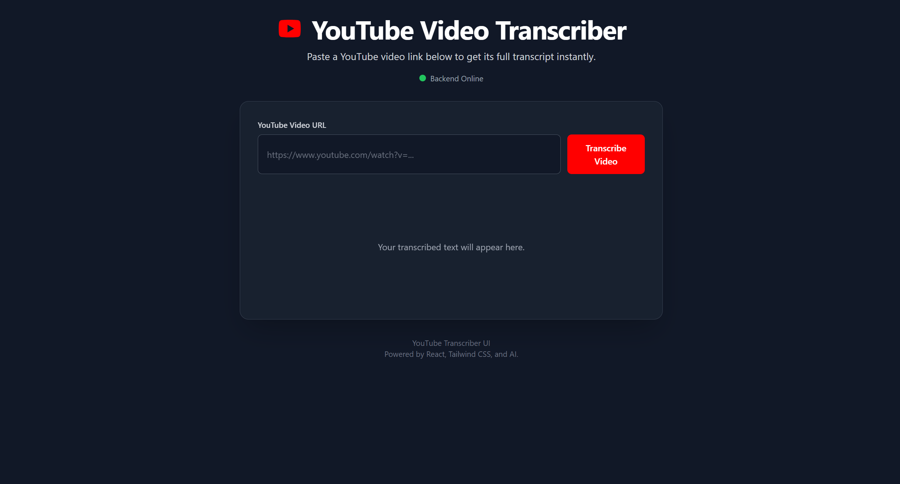

# 🎙️ YouTube Transcriber (Flask + React)

A web app that takes a YouTube video link, downloads the audio, transcribes it into text, and allows exporting the transcript as **PDF** or **Word (DOCX)**.  



## 🚀 Features
- Paste a YouTube link and get an instant transcript.  
- Export transcript as:
  - 📄 PDF  
  - 📝 Word (DOCX)  
- React frontend with simple UI.  
- Flask backend with REST API.  
- CORS-enabled for frontend-backend communication.  

---

## 🛠️ Tech Stack
- **Frontend:** 
- **Framework**: React
- **Language**: TypeScript
- **Styling**: Tailwind CSS
- **Module Bundling**: Vite 
  
- **Backend:** Flask, Flask-CORS, Python  
- **Other Tools:**  
  - `pytube` (for downloading YouTube audio)  
  - `openai/whisper` or `speechrecognition` (for transcription, depending on your implementation)  
  - `reportlab` (for PDF export)  
  - `python-docx` (for DOCX export)  

---

## 📂 Project Structure
```sh
│
├── backend/
│ ├── app.py 
│ ├── downloader.py 
│ ├── transcriber.py 
│ └── exporter.py 
│ 
├── frontend/
│   ├── components/      # Reusable React components
│   │   ├── ErrorMessage.tsx
│   │   ├── Header.tsx
│   │   ├── LoadingSpinner.tsx
│   │   ├── TranscriptOutput.tsx
│   │   └── URLInputForm.tsx
│   ├── App.tsx          # Main application component and state management
│   ├── index.tsx        # Application entry point
│   ├── constants.ts     # Global constants (e.g., API URL)
│   └── types.ts         # TypeScript type definitions
│   ├── index.html       # Main HTML file
│   └── package.json    # Project dependencies and scripts
├── README.md            # This file
└── requirements.txt 
```
### Installation

##  Clone the repository:
  ```sh
    git clone https://github.com/BenazizaAbdelkaderRiyadh/YouTube-Video-Transcriber.git
  ```

## Setup Backend (Flask)
```sh
cd backend
python -m venv venv
source venv/bin/activate   # on Linux/Mac
venv\Scripts\activate      # on Windows
pip install -r requirements.txt
python app.py
```

Backend will run on: http://127.0.0.1:5000

## Setup Frontend (React)
```sh
cd frontend
npm install
npm run dev
```
